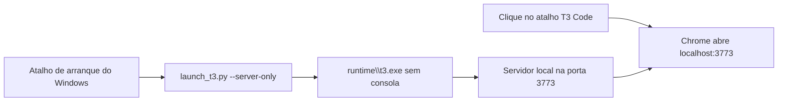

# Contexto do T3 Code Windows Launcher

## Problema resolvido

A distribuição do T3 Code inicia um servidor local e mostra no terminal um endereço de emparelhamento.
No Windows, abrir directamente `t3.exe` mantém uma consola visível e não abre automaticamente a interface.

Este launcher fecha esse intervalo. O servidor fica em segundo plano e a interface abre como aplicação do Google Chrome.

## Resultado esperado

- Um clique em **T3 Code** abre a interface.
- Nenhuma consola permanece visível.
- O mesmo atalho representa a aplicação enquanto a janela está aberta.
- O Windows inicia o servidor automaticamente depois do início de sessão.
- O launcher impede arranques simultâneos durante a inicialização.
- Tokens de emparelhamento não ficam expostos no registo local.

## Componentes

| Componente | Função |
|---|---|
| `launch_t3.py` | Inicia o servidor, lê a saída e abre o endereço correcto. |
| `install.ps1` | Cria os atalhos e inicia o servidor em segundo plano. |
| `runtime\t3.exe` | Executável oficial do T3 Code, fornecido separadamente. |
| `assets\pingdotgg-official.ico` | Ícone usado pelos atalhos do Windows. |
| `t3-launcher.log` | Diagnóstico local com tokens removidos. |

## Fluxo

## Segurança e privacidade

O launcher comunica apenas com o servidor local do T3 Code.
O repositório público não inclui o runtime, os registos locais, caches ou credenciais.

O token de emparelhamento pode aparecer na saída do T3 Code. O launcher substitui o token por `[REDACTED]` no registo.

## Actualizar o T3 Code

1. Termine o processo actual do T3 Code.
2. Substitua o conteúdo da pasta `runtime` por uma nova distribuição.
3. Conserve o nome `runtime\t3.exe`.
4. Inicie novamente o launcher.

## Resolver problemas

Se a interface não abrir, confirme que `runtime\t3.exe` existe.
Depois consulte `t3-launcher.log`.

Se o ícone antigo continuar na barra de tarefas, remova o atalho fixado.
Depois procure **T3 Code** no menu Iniciar e fixe novamente o atalho.

Se a porta 3773 estiver ocupada, termine o outro processo ou altere a configuração do T3 Code.

## Origem do ícone

O ícone deriva do avatar público de [pingdotgg](https://github.com/pingdotgg).
A organização pingdotgg mantém o [T3 Code](https://github.com/pingdotgg/t3code).

Este launcher é uma integração independente para Windows. O launcher não altera o código do T3 Code.
